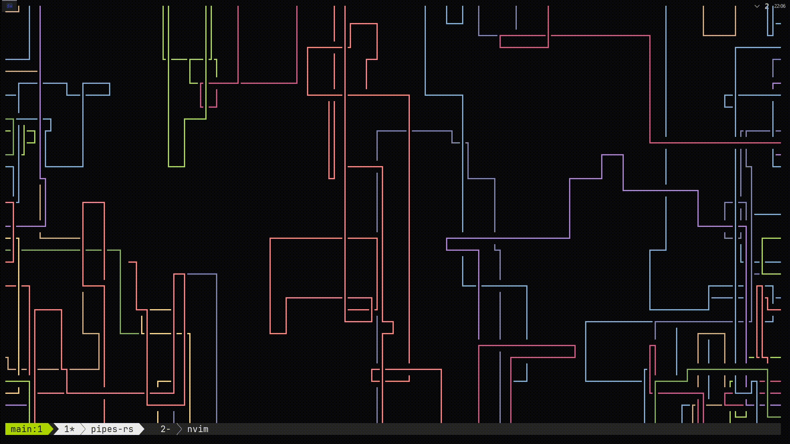

# Intro
This tmux [tpm](https://github.com/tmux-plugins/tpm) plugin makes your status bar appear only when the prefix key is pressed (and for a small amout of time thereafter).

# Preview
  
<sup>\> [example with default status bar](img/preview.gif) <</sup>

# Installaiton
You can install this plugin through [tpm](https://github.com/tmux-plugins/tpm):
1. Install [tpm](https://github.com/tmux-plugins/tpm) (duh)  
2. Add this line to your `tmux.conf`:  
```tmux
set -g @plugin 'thesast/tmux-transient-status'
```
3. Install the plugin with `<prefix>I`, unless you changed `@tpm-install` then use that.

# Configuration
This plugins offers two options to be set in your `tmux.conf` with these defaults:
```tmux
set -g @transient-status-fallback 'on'
set -g @transient-status-linger-time '2.5'
```
The former controls wether or not to fall back to `C-b` as the prefix if you or another plugin forgot to set it. Can be either `on` or `off`.  
The latter controls the amount of seconds the status bar will linger for after you are done with your command (set to `0` to disable lingering).  

# Other plugins
You might also like this plugin (shown in [preview](#preview)):

  - [tmux-powerline](https://github.com/erikw/tmux-powerline) - A tmux plugin giving you a hackable status bar consisting of dynamic & beautiful looking powerline segments, written purely in bash. 

# Licence
[MIT and Apache 2.0](COPYRIGHT.md)
